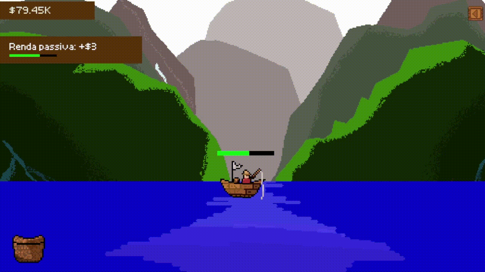

#  Koi Clicker

Jogo 2D feito em python utilizando a biblioteca Pygame.

## Como baixar e jogar

- Clique em **Code** e em seguida inicie a instalação do repositório em **Download zip**.

    É recomendado desabilitar o antivirus antes de realizar o download.

    

- Após extração dos arquivos, acesse o diretório **src** e em seguida a pasta **build**, feito isso, execute o arquivo **koi-clicker.exe** e o jogo irá iniciar.

    

